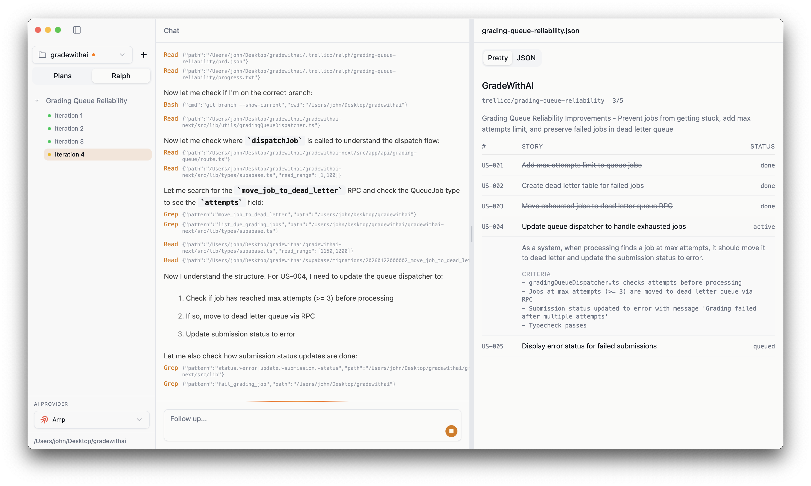

# Trellico

The most elegant and beautiful way to plan and execute Ralph loops with Claude Code.



## What is Trellico?

Trellico is a Tauri MacOS app that allows you to run Ralph loops—long-running agents that get shit done. Create plans, generate PRDs, and execute agentic loops with full visibility into Claude's reasoning and progress.

### Features

- **Plan Management** - Create and organize development plans with Claude Code
- **Ralph Loops** - Execute iterative AI development cycles with story-by-story tracking
- **Multi-Folder Support** - Work on multiple projects simultaneously with isolated state
- **Live Streaming** - Watch Claude's output in real-time as it works
- **Session Persistence** - Pause and resume AI sessions without losing context

## Requirements

- macOS (Apple Silicon or Intel)
- [Claude Code]([https://claude.ai/download](https://claude.com/product/claude-code)) installed and authenticated

## Development

```bash
# Install dependencies
pnpm install

# Run in development mode
pnpm tauri dev

# Build for production
pnpm tauri build
```

## Tech Stack

- **Frontend**: React 19, TypeScript, Tailwind CSS
- **Backend**: Rust, Tauri v2
- **AI**: Claude Code
